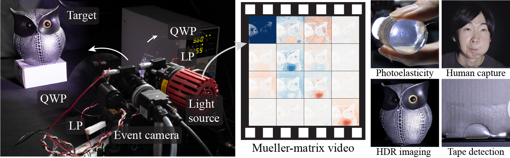

# Event Ellipsometer: Event-based Mueller-Matrix Video Imaging

[Ryota Maeda](https://elerac.github.io/), [Yunseong Moon](https://sites.google.com/view/yunseongmoon), [Seung-Hwan Baek](https://sites.google.com/view/shbaek/)

[[Project Page]](https://elerac.github.io/projects/eventellipsometer/) [[Paper]](https://arxiv.org/abs/2411.17313)



## Software Environment Setup

### Python Environment

To set up Python environment, install the libraries specified in pyproject.toml. If you are [Rye](https://rye.astral.sh/) user, you can run `rye sync` to set up the environment.

### C++ Extension

We developed a C++ extension for the event data processing to accelerate the computation The extension needs to be built manually by running the `build_cpp.py`. When building the extension, Eigen and OpenMP are required. We tested this extension on Windows.

### Event Camera and Data

[Metavision SDK](https://docs.prophesee.ai/stable/index.html) is necessary for acquiring data from event cameras and handling data I/O. Please ensure the SDK is installed and can be imported in Python using the command `import metavision_core`.

### Hardware Development

We developed a hardware prototype using [Arduino IDE](https://www.arduino.cc/en/software). To calibrate the contrast threshold, we utilized [WaveForms](https://reference.digilentinc.com/reference/software/waveforms/waveforms-3/start) to operate the Analog Discovery.

## Running the Code

```bash
python scripts/reconstruct_mm.py --filename_raw recordings\recording_2024-11-07_15-55-17_small.npz
```

The file `recording_2024-11-07_15-55-17_small.npz` is a sample event data converted from a raw data file. 

The full dataset will be available soon.

## BibTeX

```bibtex
@article{maeda2024event,
    title={Event Ellipsometer: Event-based Mueller-Matrix Video Imaging},
    author={Maeda, Ryota and Moon, Yunseong and Baek, Seung-Hwan},
    journal={arXiv preprint arXiv:2411.17313},
    year={2024}
}
```
